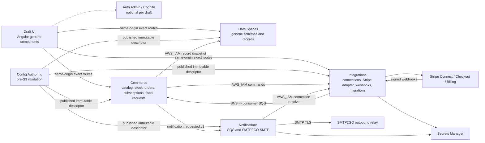

# Introduction

Implement the approved server-only integration foundation as four independently deployable AWS SAM microservices: `zoolanding-data-spaces`, `zoolanding-commerce`, `zoolanding-integrations`, and `zoolanding-notifications`. Zoolandingpage remains the generic draft renderer and UI/action orchestrator. It does not gain a platform-owner administration UI. Drafts compose their own public and protected administration routes from existing generic components.

The MVP includes Stripe Connect onboarding, hosted Checkout, one-time payments, subscriptions, editable prices, coupons, pauses, proration, physical inventory, configurable shipping, manual CFDI requests, outbound SMTP2GO notifications, and resumable bulk subscription migrations. Existing Content Hub blogs remain supported without migration; Data Spaces provides a second generic record path that future drafts may use for new content models. Phase 2 is complete locally, and Phase 3 has completed its local-only Commerce scaffold, policy resolver, and storage foundation; all provider-live gates remain explicit.

## Architecture Snapshot

| Microservice | Exclusive data ownership | Initial Lambda boundaries |
|---|---|---|
| `zoolanding-data-spaces` | Collection schemas, generic records, publication state, schema/record audit | protected read, protected action, public published read, IAM internal snapshot read |
| `zoolanding-commerce` | Sellable catalog projection, immutable offer versions, stock ledger, reservations, orders, fulfillment, commercial payment/subscription state derived from provider events, commercial migration requests/approval, fiscal requests | catalog read/action, checkout/public action, inventory action, subscription action, integration-event worker, outbox relay, reservation reconciler, fiscal request/admin |
| `zoolanding-integrations` | Integration bindings, provider resource mappings, webhook receipts/outbox, provider payment/subscription snapshot, provider migration jobs/items | connection read/action, IAM connection admin, Stripe onboarding, offer/discount provisioning, Checkout/status, subscription change/discount/pause/portal, webhook ingress, DynamoDB-stream event worker, outbox relay, migration preview/execute/control/status worker |
| `zoolanding-notifications` | Delivery ledger, attempts, circuit state | SMTP delivery worker |

## 1. Requirements & Constraints

- **REQ-001**: The solution MUST use four independently deployable microservices named `zoolanding-data-spaces`, `zoolanding-commerce`, `zoolanding-integrations`, and `zoolanding-notifications`.
- **REQ-002**: Each microservice MUST contain multiple small Lambdas where domain responsibility, public exposure, IAM permissions, scaling, timeout, or failure blast radius differ. Shared pure domain libraries prevent duplication; a Lambda MUST NOT become a separate repository solely because it is a separate function.
- **REQ-003**: Zoolandingpage MUST remain a generic renderer, component configurator, action/data-source orchestrator, and route host. It MUST NOT add a central platform-owner administration UI.
- **REQ-004**: Drafts MUST compose their own optional administration UIs from existing generic table, input, modal, card, text, and button components.
- **REQ-005**: Data Spaces MUST support draft-defined collection schemas and records without accepting arbitrary DynamoDB table names, partition keys, expressions, code, or queries from the browser.
- **REQ-006**: Existing Content Hub blogs MUST remain unchanged. Data Spaces MAY support future new blog models, but the MVP MUST NOT migrate current blogs.
- **REQ-006A**: New Data Spaces are isolated per environment/tenant/draft in the MVP. Existing Content Hub sharing remains untouched; a future cross-draft Data Space requires a separately approved explicit owner/share-binding contract and MUST NOT be inferred from matching IDs or domains.
- **REQ-007**: Commerce MUST support `physical`, `service`, `subscription`, and `add_on` sellable types.
- **REQ-008**: A protected draft administrator MUST be able to create and edit sellables, variants/SKUs, prices, subscription tiers, add-ons, inventory, shipping policy, coupons, and active state from the browser.
- **REQ-009**: Editing a price MUST create a new immutable internal `OfferVersion` and a new Stripe Price. Existing price history MUST remain addressable.
- **REQ-010**: The MVP MUST support hosted Stripe Checkout, direct charges on the draft's connected account, one-time payments, recurring subscriptions, upgrades, downgrades, proration, coupons, operator-controlled pauses, and a restricted Customer Portal.
- **REQ-010A**: Coupon economics MUST be immutable/versioned and the MVP permits at most one platform-managed coupon or promotion code per Checkout/subscription. Stacking, customer-specific codes, and multi-currency fixed discounts are deferred.
- **REQ-010B**: A pause MUST be an operator-confirmed, draft-policy-controlled operation with explicit Stripe billing behavior, service-access behavior, start/end, and resume semantics. The implementation MUST NOT infer access from Stripe subscription `status` alone.
- **REQ-011**: Bulk subscription migration MUST support dry-run, explicit approval, canary, pause, resume, retry, per-item results, next-renewal migration, and eligible immediate prorated migration.
- **REQ-012**: Inventory MUST support tracked/untracked stock, one logical location, atomic reserve/commit/release, fixed/free/pickup shipping, and manual fulfillment. Backorders, multi-warehouse, and carrier APIs are excluded.
- **REQ-012A**: Shipping and fulfillment MUST be disabled by default and enabled only by drafts selling physical one-time items. The MVP MUST reject physical recurring offers and carts mixing physical items with subscriptions.
- **REQ-012B**: Finite tracked inventory MUST use immediate card/Link payment methods in the MVP. Delayed/asynchronous payment methods require a separately tested reservation policy and remain disabled for tracked stock.
- **REQ-013**: Drafts MUST optionally collect the minimum fiscal data needed for manual CFDI preparation. The platform MUST state that the invoice is prepared and sent manually.
- **REQ-014**: Outbound transactional email MUST use SMTP2GO SMTP through `zoolanding-notifications`; AWS SES MUST NOT be introduced for this MVP.
- **REQ-014A**: Production MUST use one standalone SMTP2GO account and unique credential set per `draftId + canonical sending domain`. A production account or credential MUST NOT be reused across drafts or sending domains. A second sending domain requires a separately approved connection.
- **REQ-014B**: Test MUST use the standalone SMTP2GO account designated for `zoolandingpage.com.mx`, once provisioned and verified, one unique SMTP user/credential plus connection/rate namespace per test draft, and only a server-bound sender under that test domain. Production MUST never resolve a test account or credential. Public plan documentation lists unlimited SMTP users; if the live account contradicts that entitlement, activation MUST fail closed and the plan MUST be repriced rather than sharing a credential.
- **REQ-015**: SMTP acceptance MUST be reported as `accepted_by_smtp`, never as guaranteed delivery.
- **REQ-015A**: The SMTP MVP MUST send only to registered administrative/operator recipient sets. Stripe customer-email settings remain responsible for customer receipts and supported billing-recovery emails. Arbitrary or customer-specific SMTP recipients require a separately approved secure recipient-resolution design.
- **REQ-016**: Public checkout success URLs MUST NOT mark payments or subscriptions as paid. Verified webhook reconciliation is authoritative.
- **REQ-017**: No payment result may automatically publish, unpublish, suspend, or delete a draft.
- **REQ-018**: Optional future platform commissions MUST remain possible under Stripe direct charges, but the MVP MUST NOT collect or calculate a platform fee.
- **SEC-001**: Secrets, access tokens, webhook secrets, SMTP passwords, bank data, identity documents, raw card data, fiscal PII, signed URLs, and provider payloads MUST NOT appear in public draft files, browser bundles, repositories, logs, analytics, events, or plan artifacts.
- **SEC-002**: Real credentials MUST be stored in AWS Secrets Manager. Operational records store only opaque connection IDs or credential references and never secret values.
- **SEC-003**: Every protected read and mutation MUST resolve and compare `domain + authProfileId + tenantId + environment` server-side and default to deny.
- **SEC-004**: Protected mutations MUST reuse Auth Admin HttpOnly sessions, CSRF, current account state, and action-scoped capabilities when the draft includes user administration.
- **SEC-005**: Public actions MUST use exact allowlisted actions, server-resolved prices/policies, origin binding, rate limits, payload limits, and abuse controls.
- **SEC-006**: Stripe webhook ingress MUST verify the signature over the unmodified request bytes and configured tolerance, confirm account and `livemode`, and atomically write an idempotent receipt plus ingress-outbox record before acknowledging success. A DynamoDB Stream invokes processing; no non-atomic `DynamoDB -> SQS` handoff is allowed.
- **SEC-006A**: Stripe webhook ingress MUST use the Integrations API Gateway endpoint directly. It MUST NOT be routed through draft domains or the frontend CloudFront distribution.
- **SEC-006B**: A duplicate Stripe event with the same event ID, account, mode, and payload hash returns `2xx`; if its receipt remains incomplete, processing is resumed. The same ID with a different account, mode, or hash is rejected and alerted. Invalid signatures or timestamps outside tolerance return controlled `4xx` responses.
- **SEC-007**: Event contracts MUST be versioned, at-least-once safe, idempotent, and contain no secret, raw PII, email address, fiscal field, or raw Stripe object.
- **SEC-008**: Fiscal records MUST use a separate encrypted DynamoDB table and narrower IAM than general commerce data. Production retention MUST be approved by the accountant/legal owner before live fiscal capture.
- **SEC-009**: Test and production MUST use separate stacks, tables, queues, secrets, webhook endpoints, Stripe modes, recipient policies, and idempotency namespaces.
- **SEC-010**: Logs and audit records MUST use sanitized IDs, decision codes, correlation IDs, and aggregate counters. Raw request bodies and provider errors MUST NOT be logged.
- **SEC-011**: Administrative bulk migration MUST require capability `subscription:migration:execute`, fresh server-side authorization, dry-run revision matching, and explicit confirmation.
- **SEC-012**: Data Spaces MVP records MUST be classified `public` or `internal` and MUST NOT store restricted customer PII, credentials, payment data, identity documents, fiscal data, or sensitive form submissions. Those require a dedicated protected domain service.
- **SEC-013**: Commerce MUST NOT persist raw customer email, phone, or shipping address in the MVP. Stripe remains the protected source for customer/payment/shipping details used by manual fulfillment; Commerce stores only internal/provider references and non-PII fulfillment state. Fiscal opt-in data is the sole exception and remains isolated in `FiscalTable`.
- **SEC-014**: Provider adapters MUST own code-defined HTTPS/host/port/redirect allowlists, bounded timeouts and response sizes, and MUST NOT accept an arbitrary URL, hostname, region, secret path, or credential-forwarding target from a browser or draft record. DNS/private-network egress and redirect behavior require explicit tests before a new provider is enabled.
- **SEC-015**: Stripe Account Link, Checkout, Customer Portal, invoice/recovery, and other provider-hosted URLs MUST be generated for a server-resolved account/resource and an allowlisted return route, returned only in the immediate authorized response, and never persisted, logged, analyzed, placed in events, or accepted back as proof of success.
- **SEC-016**: Notification connection registration MUST bind the code-owned `smtp2go-smtp-v1` adapter, exact SMTP endpoint/port, environment, tenant, draft, canonical sending domain, fixed From/Reply-To policy, and unique credential reference server-side. Drafts and browsers MUST NOT supply or override those values. Production activation requires audited standalone-account/domain ownership evidence; the implementation MUST NOT assume a stable provider account identifier until SMTP2GO documents and the implementation validates one.
- **ENV-001**: `dev` is local-only. No AWS dev stack, bucket, table, queue, function, API, distribution, SSM parameter, deployment role, or deploy workflow may be created.
- **ENV-002**: Local development MAY call explicitly configured test services when a local substitute is unavailable, but MUST never address an AWS dev resource.
- **ENV-003**: `test` deploys from the protected `test` branch after `dev -> test`; production deploys from `main` after `test -> main`.
- **ENV-004**: Drafts may contain errors on `dev`, but merge/deploy to `test` and `main` MUST run blocking validation before any draft JSON is uploaded to S3.
- **ENV-005**: Production validation MUST be stricter than test: live bindings, legal/support fields, fiscal disclosure, notification recipients, shipping rules, and Stripe live/test consistency are mandatory when their features are enabled.
- **CON-001**: Reuse existing Python 3.13, AWS SAM, DynamoDB PAY_PER_REQUEST/SSE/PITR, SQS/DLQ, SNS fan-out, Auth Admin session/CSRF, exact same-origin route, structured error, and branch promotion patterns. `dev` runs CI/local only; only `test` and `main` deploy AWS.
- **CON-002**: Reuse existing Angular runtime `dataSources`/`apiActions`, generic components, `VariableStoreService`, and event handler orchestration. Do not add a frontend state or form dependency.
- **CON-003**: Use the Stripe-maintained Python SDK pinned to `stripe==15.3.0` and pin Stripe API/webhook endpoint behavior to `2026-06-24.dahlia` unless the implementation preflight proves a newer GA version and updates the plan before code changes.
- **CON-004**: Use Python stdlib `smtplib.SMTP_SSL` and `email.message` for SMTP. The first adapter uses the code-owned SMTP2GO hostname `mail.smtp2go.com` and implicit TLS port `465`. Do not add a mail dependency.
- **CON-005**: Do not reuse `zoolanding-api-proxy` for stateful commerce, provider webhooks, inventory, or subscription migration. It remains the generic bounded HTTP upstream proxy.
- **CON-006**: Do not reuse `zoolanding-combo-catalog` as a commercial catalog; its domain remains Ngx Angora presets.
- **CON-007**: Do not add Kafka, a general event bus, Step Functions, containers, distributed locks, two-phase commit, event sourcing, WAF, PAC integration, IMAP, mailbox UI, newsletters, or carrier APIs in this MVP.
- **CON-008**: Do not add SMTP2GO REST sending, provider webhooks, activity synchronization, archiving, inbound email, open tracking, or click tracking in the MVP. SMTP acceptance plus the local ledger is the implemented contract; later provider events require a separately approved ingress/security design.
- **PAT-001**: Each service owns its tables and outbox/inbox records. Services MUST NOT read another domain service's tables directly. The only inherited read-only exceptions are `dynamodb:GetItem` against Auth Admin session/user-state tables for the existing session/current-state contract and Config Registry/S3 published-pointer/descriptor reads required by PAT-007. No new service may mutate either dependency's data.
- **PAT-002**: Synchronous service-to-service commands MUST use exact AWS_IAM-protected internal API paths. Asynchronous fan-out MUST use publisher-owned SNS topics and consumer-owned SQS queues/DLQs.
- **PAT-003**: All partition keys MUST begin with an environment and tenant/draft boundary. Provider IDs alone MUST never be global lookup keys.
- **PAT-004**: Checkout orchestration MUST reserve inventory and create the internal order in one Commerce transaction before calling Integrations. Unknown Checkout outcomes MUST reconcile before releasing stock.
- **PAT-005**: Integrations exclusively owns and mutates the canonical Stripe/provider snapshot. Commerce exclusively owns commercial order/access/fulfillment state derived from versioned Integration events and MUST NOT independently assert Stripe facts. Webhook processing atomically updates the receipt, provider snapshot, and outgoing event record before SNS publication.
- **PAT-006**: Data Space records MAY hold generic descriptive data. Prices, stock, orders, payments, subscriptions, and fiscal PII MUST remain in Commerce/Integrations ownership.
- **PAT-007**: Every service resolves its own immutable server-only descriptor by reading the Config Registry published pointer for `environment + draft`, then the exact S3 object under that version prefix. Cache keys include `environment + draft + versionId`; missing/mismatched descriptors fail closed. Reverting the published pointer reactivates the prior immutable policy without an apply endpoint or event bus.
- **PAT-008**: Commerce owns the commercial migration request, source/target OfferVersions, authorization, and approval. Integrations owns only the Stripe execution job/items and reports versioned progress/results back to Commerce.
- **OPS-001**: Webhook receipts and idempotency records MUST expire after 90 days unless an incident hold applies. Business/financial records MUST not inherit that TTL.
- **OPS-002**: Each service MUST expose redacted metrics for latency, errors, throttling, DLQ depth, oldest message age, and service-specific failure states.
- **OPS-003**: Every state-changing operation MUST carry `requestId`, `correlationId`, `environment`, `draftId`, `tenantId`, actor hash when authenticated, and an idempotency key.
- **OPS-004**: Feature enablement MUST be per draft and default off. Rollout MUST begin with test pilots for `zoositioweb.com.mx` and `sulandingpage.com.mx` before production.

## 2. Implementation Steps

### Implementation Phase 0 - Baseline, drift reconciliation, and cost gate

- GOAL-001: Establish a clean, current, non-destructive baseline before creating repositories or infrastructure.

| Task | Description | Completed | Date |
|------|-------------|-----------|------|
| TASK-001 | Record `git status --short --branch` for `Z:\GitHub\zoolandingpage` and every sibling dependency. Preserve all user changes. Do not pull, reset, clean, checkout, or overwrite a dirty repository. | PASS | 2026-07-14 CT |
| TASK-002 | Reconcile the current `zoolandingpage` worktree, which was observed on 2026-07-13 as `dev` ahead 2/behind 183 with user changes in `ai-notes/future-features-ideas/platform-improvement-opportunities.md`, `package-lock.json`, and untracked `ai-notes/future-features-ideas/stripe-connect-payments-per-draft.md`, before implementation begins. | PASS | 2026-07-14 CT |
| TASK-003 | Pull each clean sibling repository with `git pull --ff-only`; report and stop only for the dirty target repository. Verify remote state before copying local workflows because local sibling copies still showed stale `deploy-dev.yml` files. | PASS | 2026-07-14 CT |
| TASK-004 | Verify the retired AWS dev boundary against the current remote `zoolandingpage-aws-infra` state and AWS inventory. Produce a read-only inventory proving no integration plan will recreate dev resources. | PASS | 2026-07-14 CT |
| TASK-005 | Produce the baseline AWS/Stripe/HostGator cost estimate for test and production: API Gateway, Lambda, DynamoDB, SQS, SNS, Secrets Manager, CloudWatch, Stripe transaction fees, and expected SMTP limits. Record fixed monthly cost and usage formulas before deployment approval. This historical baseline does not price the later SMTP2GO decision. | PASS historical baseline; SMTP2GO delta pending in TASK-005A | 2026-07-14 CT |
| TASK-005A | Before buying or activating delivery, recalculate SMTP2GO cost using the exact selected test plan plus one standalone production account per `draftId + canonical sending domain`. Verify current checkout price, tax/currency, quota, overage, SMTP-user entitlement, sender-domain entitlement, support level, account-review requirements, DPA/data-center assignment, content/header retention, and aggregate cost across accounts. Do not pool quotas or reuse the advertised 50,000-message price as a cross-account total. | RESEARCH PASS; test account, sender DNS, Sandbox, and distinct SMTP-user entitlement verified; credential, recipient-policy, delivery, tax, and paid-checkout gates pending | 2026-07-20 CT |
| TASK-006 | Confirm from official Stripe documentation immediately before writing production code that `stripe==15.3.0` and API version `2026-06-24.dahlia` remain the current supported GA pair. If either changed, update `CON-003`, dependencies, and contract fixtures before writing production code. | PASS; repeat before code | 2026-07-14 CT |

Decision recorded 2026-07-14 CT: Phase 1 may proceed locally using the audited assumed-volume cost model and fail-closed contracts. Accountant answers, real Stripe volumes, and written authorization for HostGator SMTP —or selection and pricing of an approved transactional provider— remain explicit live-production gates. Until they are closed, the implementation MUST NOT infer tax treatment, activate Stripe Tax, enable real SMTP delivery, capture live fiscal PII, provision production secrets, or authorize a test/production deployment that depends on those capabilities.

Provider decision recorded 2026-07-17 CT: SMTP2GO replaces HostGator as the approved outbound transport. Test uses the SMTP2GO account designated for `zoolandingpage.com.mx` after provisioning and verification; production uses one standalone account and credential set per draft/canonical sending domain. The generic `email.smtp` contract, deterministic secret paths, and `accepted_by_smtp` status remain unchanged. TASK-005A, account/domain provisioning, sender authentication, recipient restrictions, current provider terms, and delivery evidence remain live gates. Inbound email and mailbox UI are deferred without a selected architecture.

TASK-005A public research recorded 2026-07-17 CT: the minimum candidate is one Free test account plus one Starter 10K account per production binding. The initial pilot has two production bindings, so SMTP is budgeted at USD 20–30/month or USD 200–300/year before account-specific tax and overage. Added to the existing simultaneous test + pilot AWS baseline, the conditional envelope is USD 38.873921–48.873921/month on monthly SMTP billing or USD 35.540588–43.873921/month equivalent on annual billing. For growth, `A` is the count of production `(draftId, canonical sending domain)` bindings; `A=10` is only the one-binding-per-draft sensitivity, yielding USD 153.997477–203.997477/month for AWS + SMTP. These are ranges because the public pricing page conflicts: fallback copy shows Starter 10K at USD 10/month or USD 100/year, while embedded configuration shows USD 15/month or USD 150/year. Authenticated checkout for each production account is the price/tax authority.

Free test remains conditional: the baseline counts notification Lambda invocations, not billable SMTP messages, and Sandbox entitlement must be verified in the live account. Public documentation lists 1,000 messages/month, 200/day, unlimited SMTP users, five verified senders, five-day activity history, and no overage for Free; Starter lists 10,000/month, 30-day activity history, full support, and overage only after the account is fully activated. Before any purchase or delivery, verify per account the measured message volume, exact checkout/tax, review status, DPA, assigned region, sender DNS, tracking/archiving/Email Auditing disabled, TLS without plaintext fallback, and a written request/response about disabling SMTP2GO's documented 35-day sampled-email storage. All headers remain documented as retained for 35 days, so messages must stay minimal. Pilot production should begin monthly; annual billing is reconsidered only after stable operation.

Incident gate recorded 2026-07-14 16:32 CT: read-only `HEAD` probes confirmed that the currently deployed test and production frontend artifacts expose repository metadata and an encoded path to a server-only draft descriptor. The local build/SSR boundary is being corrected in Phase 1, but Phase 1 cannot close and no promotion is authorized until an explicitly approved incident procedure publishes a sanitized artifact, invalidates caches, audits/quarantines prior releases and access evidence without printing sensitive content, rotates only verified exposed credentials, and completes browser QA.

### Implementation Phase 1 - Contracts and pre-S3 release guards

- GOAL-002: Define versioned public/server-only contracts and block invalid integration drafts before any S3 write.

| Task | Description | Completed | Date |
|------|-------------|-----------|------|
| TASK-007 | Add `docs/api-driven-config/schemas/data-spaces.schema.json`, `commerce.schema.json`, `integration-bindings.schema.json`, and `notification-policies.schema.json` with `additionalProperties: false`, bounded field counts/sizes, safe IDs, and no secret-valued fields. | Local PASS | 2026-07-14 CT |
| TASK-008 | Extend `docs/api-driven-config/schemas/protected-features.schema.json` so runtime bindings add `data-space`, `commerce`, and `integrations` kinds with explicit action-scoped capabilities while preserving the existing `api-proxy` and `auth-admin` kinds used by current blog/auth drafts. | Local PASS | 2026-07-14 CT |
| TASK-009 | Add `docs/api-driven-config/22-server-only-integration-microservices.md` documenting ownership, exact routes, event envelopes, error codes, environment boundaries, and examples with synthetic values only. | Local PASS | 2026-07-14 CT |
| TASK-010 | Add `tools/lib/server-feature-contract-validator.mjs` by extracting the repository's existing dependency-free JSON Schema validation pattern; add semantic checks for missing bindings, public/server-only leakage, invalid feature combinations, duplicate IDs, and test/live mismatches. | Local PASS | 2026-07-14 CT |
| TASK-011 | Add `tools/draft-feature-readiness.mjs` with modes `dev`, `test`, and `production`. `dev` reports findings without upload; `test` and `production` exit nonzero on blocking findings and emit a redacted machine-readable report. | Local PASS | 2026-07-14 CT |
| TASK-012 | Add `tools/tests/draft-feature-readiness.spec.mjs` and fixtures proving valid/invalid data-space, commerce, Stripe, inventory, subscription, fiscal, and notification configurations. Prove a secret-looking value, credential value, environment/connection-binding mismatch, or missing production requirement blocks readiness. Provider account ownership remains a later server-side Integrations check and MUST NOT be modeled by adding provider account IDs to draft descriptors. | Local PASS | 2026-07-14 CT |
| TASK-013 | Add `drafts:feature-readiness` and its test command to `package.json` without adding a dependency; preserve unrelated user edits in `package-lock.json`. | Local PASS | 2026-07-14 CT |
| TASK-014 | Extend `tools/templates/draft-repo/tools/deploy-draft.mjs` and its copied readiness helper so test/production validation runs before AWS credential configuration or `signedPostJson`; update PR guards for `dev -> test` and `test -> main` plus both deploy workflows to run `--validate-only` before merge/deployment. Prove post-merge provenance with the exact associated merged PR, same-repository source/base pair, merge parents, push `before` SHA, and current target tip; serialize per environment. Exclude `draft-repo.config.json` from payloads. | Local PASS | 2026-07-14 CT |
| TASK-014B | Require exact selected-branch policies on both GitHub Environments and the same exact `ref` in each AWS OIDC role trust; derive roles only from the registered draft inventory. Configure no Environment after branch-protection failure and report aggregate failure for any missing branch/Environment control. | Local PASS; live remediation pending authorization | 2026-07-14 CT |
| TASK-014A | Replace recursive frontend `drafts/**` asset copying with an exact public JSON/media allowlist, reject encoded/case-variant private paths in SSR, inspect generated browser/SSR artifacts with bounded redacted output, and run the guard before AWS credentials or upload. Treat the confirmed live exposure as an incident: local correction does not authorize deploy, invalidation, inspection of object bodies, or credential rotation. | Local guard PASS; live mitigation pending authorization | 2026-07-14 CT |
| TASK-015 | Add `server_policy_validation.py` to `Z:\GitHub\zoolanding-config-authoring`, call it inside `_normalize_files` before `_store_files`, and revalidate the exact stored manifest inside `_publish_draft` before moving any published pointer. For an enabled notification policy, derive only its deterministic environment/tenant/draft SMTP and recipient secret paths and call `DescribeSecret` under narrowly scoped IAM; reject missing, scheduled-for-deletion, disabled, or ownership-tag-mismatched secrets before publication, never accept an arbitrary secret ARN/path, and never call `GetSecretValue`. Errors and logs use stable redacted codes and MUST NOT include exception text, secret names, ARNs, tags, policy values, or provider responses. | Local PASS; deployment gate remains | 2026-07-14 CT |
| TASK-016 | Extend `Z:\GitHub\zoolanding-config-authoring\lambda_function.py::_infer_kind` and the app/draft packaging tools with one exact path-to-kind map for all six server files: `server/auth-profile-registry.json -> server-auth-profile-registry`, `server/integrations.json -> server-integrations`, `server/data-spaces.json -> server-data-spaces`, `server/commerce.json -> server-commerce`, `server/integration-bindings.json -> server-integration-bindings`, and `server/notification-policies.json -> server-notification-policies`. Reject unknown `server/*.json` and caller-supplied kind mismatches. | Local PASS | 2026-07-14 CT |
| TASK-017 | Add authoring tests proving invalid packages produce no S3 writes, invalid stored packages cannot publish, a missing/disabled/deleting/wrong-scope notification secret prevents pointer movement, dev or stack/request environment mismatch is rejected before writes, and test/production validation errors expose no server policy or secret metadata. Make version packages immutable with an exact file manifest and SHA-256 hashes, reject every reused `versionId`, derive the S3 prefix from canonical domain/version with a trailing delimiter, and move pointers with an expected-revision conditional write. Add a versioned resolver fixture covering `v1`, `v2`, and prefix-confusable `v10`, then prove publishing a previously stored valid version rolls the pointer back without rewriting package objects. | Local PASS | 2026-07-14 CT |

Local Phase 1 verification record, 2026-07-14 CT: three consecutive post-fix Zoolandingpage audits each passed draft context `10/10`, feature readiness/template `37/37`, artifact boundary `5/5`, public safety `7/7`, combined Node contracts `156/156`, focused Angular validation `79/79` in Brave, Actionlint, and `git diff --check`. Config Authoring separately passed three consecutive `68/68` unit-test cycles with Python compilation, JSON/YAML parsing, schema parity, and diff checks. These local results do not close the live incident or authorize deployment.

Phase 1 contract constants fixed before implementation:

- New descriptor kinds are exactly `server-data-spaces`, `server-commerce`, `server-integration-bindings`, and `server-notification-policies`; the two existing server kinds remain supported.
- Code-owned Data Spaces capabilities are exactly `data-space:record:read`, `data-space:record:write`, `data-space:schema:write`, and `data-space:publish`; Commerce capabilities are exactly `commerce:catalog:read`, `commerce:catalog:write`, `commerce:inventory:write`, and `commerce:subscription:manage` in Phase 1.
- Notification contracts initially allow only `payment-succeeded -> payment-succeeded-v1` and `payment-failed -> payment-failed-v1`; their sets must match exactly. Unique active SMTP plus recipient secret references are capped at 20 per package.
- The only Phase 1 fiscal disclosure ID is `manual-invoice-v1`. Draft-supplied approval IDs never open a production live gate.
- Protected Data Spaces/Commerce policies using `auth-profile` must resolve to an existing active Auth Profile with matching tenant and optional domain scope.
- Notification secret names are derived only as `/zoolanding/{environment}/{tenantId}/{draftId}/notifications/smtp/{connectionId}` and `/zoolanding/{environment}/{tenantId}/{draftId}/notifications/recipients/{recipientSetId}/{recipientSetVersion}/{recipientMemberId}` after strict lowercase ASCII ID validation.
- Every notification secret must have exact tags `zoolanding:environment`, `zoolanding:tenant-id`, `zoolanding:draft-id`, `zoolanding:secret-purpose`, and `zoolanding:enabled=true`. SMTP secrets additionally require `zoolanding:connection-id`; recipient secrets require `zoolanding:recipient-set-id`, `zoolanding:recipient-set-version`, and `zoolanding:recipient-member-id`. Missing tags fail closed. `DeletedDate` means deleting; disabled means the enabled tag is absent or not exactly `true`.
- JSON Schema enforcement must support every keyword used by the four schemas, including closed objects, bounded strings/arrays/objects, unique items, safe integers, references, compositions, and conditionals, or reject the schema itself as unsupported. Node and Python validators use the same synthetic golden corpus and cap depth, input size, and reported errors.
- `account mismatch` in this phase means a local environment/mode/opaque `connectionId` mismatch. Real Stripe account ownership and webhook account binding remain server-side Integrations responsibilities.

Phase 1 local implementation status recorded 2026-07-14 CT: TASK-007 through TASK-017 pass locally, including the exact public-artifact guard, exact associated-PR/current-tip promotion proof, Environment/role branch restrictions, and Config Authoring's immutable manifest/pointer controls. AWS SAM CLI `1.163.0` subsequently validated `Z:\GitHub\zoolanding-config-authoring\template.yaml` with `--lint`. The phase remains open for release: the deployed draft-artifact incident is not mitigated; the exact Environment policies, IAM trust updates, and workflow templates are not rolled out to the live draft fleet; Config Authoring deploy jobs are deliberately disabled until SAM `CodeUri` is replaced by a verified allowlisted artifact; and no AWS integration or provider-live test has been authorized.

Phase 1 implementation closure recorded 2026-07-16 22:55 CT and production verification completed 23:36 CT: the previously pending Config Authoring allowlisted artifact, IAM-only deployment, fleet branch/Environment trust controls, sanitized frontend artifact, private-path probes, release-prefix inventory, and desktop/mobile QA are active and recorded in the canonical deployment guide and app changelog. Runtime Read's six recovered security findings—deny-by-default public projection, bounded Content Hub index/article work, bounded config/content S3 reads, and immutable exact-SHA deployment artifacts—plus an exact anonymous `GET /runtime-bundle` throttle were promoted through `dev -> test -> main`. Both AWS stacks retained their original API/Lambda identities, execution boundaries, and concurrency; test/production runs and sanitized public/private-path smokes passed. The canonical schema and Config Authoring also reject more than four runtime Content Hubs before publication. TASK-007 through TASK-017 are therefore complete as an implementation foundation. This is not a provider-live authorization: historical access cannot be reconstructed because S3/CloudFront access logging was not enabled, so the explicit residual-risk/credential decision remains open, along with Stripe topology/tax/webhook evidence, SMTP2GO plan/account/domain/credential evidence, fiscal operating approval, owning-service deployment, and pilot evidence. Phase 2 remains local-only with no AWS resources or `dev` deployment profile.

### Implementation Phase 2 - Data Spaces microservice

- GOAL-003: Provide bounded generic per-draft collection schemas and records without exposing database internals.

| Task | Description | Completed | Date |
|------|-------------|-----------|------|
| TASK-018 | Create local repository `Z:\GitHub\zoolanding-data-spaces` with `AGENTS.md`, `Codex.md`, `README.md`, `template.yaml`, `samconfig.toml`, `requirements.txt`, `src/common/published_policy.py`, `src/`, `tests/`, and only `ci.yml`, `deploy-test.yml`, and `deploy-production.yml`. Implement PAT-007 for `server/data-spaces.json`. Do not create `deploy-dev.yml` or a dev deploy profile in `samconfig.toml`. | Local PASS | 2026-07-16 CT |
| TASK-019 | Define `DataSpace`, `CollectionSchema`, `Record`, and `PublishedRecord` storage in one PAY_PER_REQUEST DynamoDB table with SSE, PITR, conditional revisions, and keys prefixed by `ENV#{environment}#TENANT#{tenantId}#DRAFT#{draftId}`. | Local PASS | 2026-07-16 CT |
| TASK-020 | Implement separate handlers `src/handlers/protected_read.py`, `protected_action.py`, `public_read.py`, and `internal_snapshot_read.py` for exact routes `/features/data-spaces/read`, `/features/data-spaces/action`, `/features/data-spaces/public-read`, and AWS_IAM-only `/internal/v1/data-spaces/record-snapshot`. | Local PASS | 2026-07-16 CT |
| TASK-021 | Implement `src/domain/schema_policy.py` with bounded scalar, enum, object, array, date, money-display, asset-reference, relation-ID, and `public\|internal` classification definitions. Reject restricted/PII/payment/fiscal field classes, executable expressions, arbitrary URLs, table/index names, DynamoDB expressions, HTML from untrusted public writes, and recursive schemas. | Local PASS | 2026-07-16 CT |
| TASK-022 | Implement capability checks `data-space:record:read`, `data-space:record:write`, `data-space:schema:write`, and `data-space:publish`, using Auth Admin session/CSRF and fresh state for protected actions. | Local PASS | 2026-07-16 CT |
| TASK-023 | Implement public reads only for explicitly published fields/records and add pagination tokens opaque to the browser. Public reads MUST never expose owner keys, tenant IDs, audit records, draft records, or internal indexes. | Local PASS | 2026-07-16 CT |
| TASK-024 | Add unit, contract, authorization, concurrency, pagination, public-projection, size-limit, and cross-draft negative tests. Run `python -m unittest discover -s tests -p "test_*.py"`, `pip-audit -r requirements.txt`, and `sam validate`. | Local PASS | 2026-07-16 CT |

Phase 2 local implementation closure recorded 2026-07-16 CT: the new local-only `zoolanding-data-spaces` repository implements PAT-007, four separately permissioned handlers, one draft-scoped conditional DynamoDB model, closed schema/value types, fresh Auth Admin authorization, CSRF-protected mutations, 90-day idempotency receipts, immutable revisions, safe public projections, opaque pagination, and exact AWS_IAM snapshot reads with a canonical content hash. Post-review hardening rejects oversized Base64 before decode, binds internal calls to one configured trusted Commerce role, throttles the anonymous public-read method at 25 requests/second with burst 50, and makes schema evolution additive once records exist so a public field cannot later be silently reclassified while its old projection remains exposed. The complete local suite passes 83 tests, dependency audit, Python compilation, SAM lint/build, built-handler imports, workflow lint, and a Git-index-based closed artifact inspection. No AWS resource, GitHub remote/CI run, provider connection, customer data, or secret was created. Test/production deployment remains unauthorized until environment identities and least-privilege internal caller policy, routing/direct-endpoint controls, alarms, storage/write quotas, explicit non-PII operating controls, Auth Admin domain-reassignment revocation, runtime-SDK packaging policy, and cross-service smoke evidence are reviewed.

### Implementation Phase 3 - Commerce microservice

- GOAL-004: Implement generic commercial state and invariants independently of Stripe.

| Task | Description | Completed | Date |
|------|-------------|-----------|------|
| TASK-025 | Create local repository `Z:\GitHub\zoolanding-commerce` with the same no-dev deployment layout and Python 3.13/SAM conventions as Phase 2. Add `src/common/published_policy.py` implementing PAT-007 for `server/commerce.json`; do not add a dev deploy profile. | Local PASS | 2026-07-20 CT |
| TASK-026 | Create retained PAY_PER_REQUEST/SSE/PITR `CommerceCatalogTable` for catalog, offers, stock, and reservations; `CommerceOperationsTable` for orders, non-PII fulfillment/payment/subscription projections, inbox/outbox, and audit; and a separate retained `FiscalTable`. Enable only a `NEW_IMAGE` DynamoDB Stream on Operations. Keep Fiscal without TTL until retention is approved, and add no Lambda, event-source mapping, queue, API, role, or index in this storage-only task. | Local PASS | 2026-07-20 CT |
| TASK-027 | Implement domain modules `src/domain/catalog.py`, `offers.py`, `inventory.py`, `orders.py`, `subscriptions.py`, `shipping.py`, and `fiscal.py`. Keep prices as integer minor units and ISO currency codes; never use floating-point money. | | |
| TASK-028 | Implement `CatalogItem` types `physical`, `service`, `subscription`, and `add_on`, optional Data Space record references, variants/SKUs, immutable `OfferVersion`, immutable economic/restriction `DiscountVersion`, and lifecycle states `draft -> provisioning -> active -> existing_only -> retired`. A `DiscountVersion` supports one percentage or single-currency minor-unit amount, `once\|forever\|repeating` duration, optional eligible OfferVersions, redemption limit/deadline, and one optional customer-facing code; editing any economic/restriction field creates a new version. Store enable/disable and safe display metadata under separate monotonically increasing lifecycle/presentation revisions so neither changes the immutable provider fingerprint. When a Data Space reference is used, Commerce obtains an allowlisted snapshot through the IAM internal endpoint during activation; Checkout never performs a live cross-service join. | | |
| TASK-029 | Implement `adjust -> reserve -> commit\|release` stock movements with DynamoDB conditional transactions. Create the Operations order and Catalog reservation atomically with one cross-table `TransactWriteItems`. Limit a Checkout to 20 distinct lines and calculate required transaction actions before writing so the request remains below DynamoDB's limit. For tracked inventory, calculate one absolute `checkoutExpiresAt = reservationCreatedAt + 35 minutes`, pass it to Stripe, and hold the reservation until `checkoutExpiresAt + 5 minutes` for reconciliation. Release immediately only after a definitive provider rejection proven not applied, including a confirmed precondition rejection for an already-too-short expiry; a timeout, network failure, `5xx`, or other ambiguous result retries the same PaymentAttempt/idempotency key and reconciles status before release. Run `reservation_reconciler.py` every 5 minutes against explicit expiries, query the exact internal Checkout-status endpoint before releasing an uncertain reservation, and use DynamoDB TTL only for eventual cleanup. | | |
| TASK-030 | Implement exact handlers `catalog_read.py`, `catalog_action.py`, `inventory_action.py`, `checkout.py`, `subscription_action.py`, `integration_event_worker.py`, `outbox_relay.py`, `reservation_reconciler.py`, `fiscal_request.py`, and `fiscal_admin.py` with the smallest IAM policy per handler. Public catalog handlers receive no Operations/Fiscal permission, and only the exact fiscal handlers receive Fiscal permission. | | |
| TASK-031 | Implement exact browser routes `/features/commerce/read`, `/features/commerce/action`, `/features/commerce/public-action`, `/features/commerce/fiscal/request`, and `/features/commerce/fiscal/admin`. Integration state reaches Commerce through its dedicated SQS consumer, so no wildcard internal Commerce API is created. | | |
| TASK-032 | Add `CommerceNotificationRequestsTopic`, `CommerceIntegrationEventsQueue`, its DLQ, event inbox, and a stream-driven outbox relay. The Operations event-source mapping filters the approved outbox record shape, enables `ReportBatchItemFailures`, and sends exhausted stream batches to a dedicated SQS failure queue whose payload contract is not shared with the integration-event DLQ. Define only confirmed-state events with real consumers, beginning with `notification.requested.v1`. Subscribe the Commerce queue to `IntegrationEventsTopic`. State changes write outbox items in their local transaction; only the relay publishes and marks them delivered idempotently. Offer/discount provisioning, Checkout creation, subscription mutations, and migration preview/execute/control use exact AWS_IAM command APIs and MUST NOT also be emitted as duplicate command events. | | |
| TASK-033 | Implement fiscal request opt-in, minimum RFC/legal/contact fields, correction/status workflow, accountant-only capabilities, explicit manual-delivery disclosure, and no PAC/file generation. For unauthenticated checkout, issue a short opaque single-use fiscal claim only after webhook-verified payment; store only its hash/expiry/attempt state and bind it to the paid order. Test uses a 24-hour window; production requires an accountant-approved configured window. Block production fiscal capture until retention and access policy are approved. | | |
| TASK-034 | Add unit and integration tests for money precision, offer versioning, conditional inventory, duplicate events, reservation reconciliation, refund-without-auto-restock, fiscal isolation, tenant mismatch, and all error paths. | | |

TASK-026 local closure recorded 2026-07-20 CT: the undeployed Commerce SAM template now defines exactly the three retained tables, with on-demand billing, server-side encryption, point-in-time recovery, `pk`/`sk` keys, no speculative indexes, TTL only on Catalog/Operations, and a `NEW_IMAGE` stream only on Operations. DynamoDB stream filtering, partial-batch reporting, failure destinations, and handler IAM require the real Lambda consumer boundary, so they remain explicitly assigned to TASK-030/TASK-032 instead of creating placeholder resources. Three audit/fix/retest passes completed with 17 tests, Python compilation, SAM lint/build, workflow lint, dependency audit, closed-resource assertions, and redacted secret scanning. Independent review found no blocking or major issue. No AWS resource, GitHub remote, provider connection, credential, PII, fiscal record, or customer data was created.

### Implementation Phase 4 - Integrations microservice and Stripe adapter

- GOAL-005: Implement the generic connection control plane and the first provider adapter without leaking Stripe concerns into Commerce or drafts.

| Task | Description | Completed | Date |
|------|-------------|-----------|------|
| TASK-035 | Create local repository `Z:\GitHub\zoolanding-integrations` with no deploy-dev workflow/profile. Pin `boto3==1.39.13` and `stripe==15.3.0` in `requirements.txt`; document why the official Stripe SDK is the sole new runtime dependency. Add `src/common/published_policy.py` implementing PAT-007 for `server/integration-bindings.json`. | | |
| TASK-036 | Create `IntegrationRegistryTable` for connections/bindings/provider-resource mappings and `WebhookReceiptTable` for receipt, ingress-outbox, outgoing-outbox, processing state, and idempotency with 90-day TTL. Enable PAY_PER_REQUEST, SSE, PITR, environment/draft tenant keys, DynamoDB Streams, separate filters for ingress/outgoing records, partial-batch failure handling, and on-failure SQS destinations. Create `IntegrationEventsTopic` for normalized confirmed-state events. | | |
| TASK-037 | Implement generic `IntegrationConnection` and `IntegrationBinding` records with provider type, status, capability set, opaque `connectionId`, account/resource mappings, and deterministic secret path metadata. Stripe credentials use `/zoolanding/{environment}/integrations/{tenantId}/{draftId}/stripe/{connectionId}`; SMTP credentials use `/zoolanding/{environment}/{tenantId}/{draftId}/notifications/smtp/{connectionId}`. The registry stores only approved path metadata, never a secret value. For notifications it binds `provider=email.smtp` to server-owned `smtp2go-smtp-v1`, expected environment/tenant/draft/canonical sending domain, and audited account-ownership state. Test resolves only the `zoolandingpage.com.mx` account; production rejects account/credential reuse across draft/domain bindings. | | |
| TASK-038 | Implement `connection_read.py` and `connection_action.py` at exact routes `/features/integrations/read` and `/features/integrations/action` for sanitized generic connection state. Implement separate `stripe_onboarding.py` at `/features/integrations/stripe/onboarding` because it has Stripe-secret IAM. Reuse Auth Admin session, CSRF, current state, and capabilities `integration:read` and `integration:manage`. | | |
| TASK-039 | Implement Stripe Connect direct-charge onboarding. Use Accounts v2 only when current official GA documentation and a test-mode proof cover Mexico and required capabilities; otherwise use Accounts v1 controller properties. Create each Account Link server-side for the binding's exact connected account after fresh `integration:manage` authorization; use code-owned HTTPS refresh/return route allowlists, opaque state bound to environment/tenant/draft/account/session and expiry, one-time consumption, and canonical status retrieval after return. Never accept an account ID or return URL from the browser and never treat the return itself as onboarding completion. Persist only safe account status and requirement summaries. | | |
| TASK-040 | Implement separate AWS_IAM Lambdas/handlers for `POST /internal/v1/stripe/offer`, `POST /internal/v1/stripe/product-presentation`, `POST /internal/v1/stripe/discount`, `POST /internal/v1/stripe/discount-lifecycle`, `POST /internal/v1/stripe/checkout`, `GET /internal/v1/stripe/checkout-status`, `POST /internal/v1/stripe/subscription/change`, `POST /internal/v1/stripe/subscription/discount`, `POST /internal/v1/stripe/subscription/pause`, `POST /internal/v1/stripe/customer-portal`, `POST /internal/v1/stripe/migrations/preview`, `POST /internal/v1/stripe/migrations/execute`, `POST /internal/v1/stripe/migrations/control`, `GET /internal/v1/stripe/migrations/status`, `POST /internal/v1/integrations/connection-register`, and `POST /internal/v1/integrations/connection-resolve`. Keep shared validation/provider code in pure modules, not one dispatch Lambda. Use a separate `connection_admin.py` Lambda for registration so browser connection actions never receive secret-metadata IAM. Registration accepts metadata and an existing credential reference, validates the secret exists and provider/host/port policy, but never accepts a secret value. For offer/discount provisioning, Commerce sends the immutable internal version ID plus a bounded, schema-versioned economic/restriction snapshot and content hash; Integrations validates and persists it with its Stripe mapping and never reads Commerce tables. Offer snapshots contain amount, currency, sale type, recurrence, and tax behavior; discount snapshots contain type/value, currency when fixed, duration, eligible offer bindings, limits/deadline, and optional promotion-code value, but no mutable active/display state. Separate idempotent presentation/lifecycle commands carry their own monotonic revision and content hash. Checkout and subscription commands send only authorized internal IDs/revisions, while Integrations resolves Stripe objects/account IDs from its own mappings. Status reads validate the original order/job/draft binding before returning normalized state. Connection resolution validates `environment + tenant + draft + provider + capability` and returns only approved host/port and a server-only credential reference; callers never choose a secret path. | | |
| TASK-041 | Implement Stripe Product/Price and Coupon/PromotionCode provisioning idempotently. The Price fingerprint includes amount in minor units, currency, one-time/recurring type, recurring interval (`month\|year`), `interval_count=1`, `billing_scheme=per_unit`, `usage_type=licensed`, and tax behavior. The discount fingerprint covers every immutable economic/restriction field; any such edit provisions a new Coupon/PromotionCode mapping. Product/coupon display metadata updates use only a newer presentation revision and accept bounded plain text without HTML, control characters, header delimiters, or arbitrary URLs. Discount disable uses a newer lifecycle revision to prevent future redemption by deactivating its PromotionCode and retiring/deleting the Coupon as Stripe permits, while retaining historical mappings and existing applied discounts. Enforce one platform-managed discount, case-insensitive active-code uniqueness, and the REQ-010A exclusions. Reject metered usage, tiers, custom unit amounts, unsupported intervals/counts, physical recurring offers, and mixed physical/subscription carts. A failed provider operation leaves the Commerce version non-buyable. | | |
| TASK-042 | Implement hosted Checkout for one-time and subscription modes with server-resolved line items, connected account, tax/shipping/coupon policy, Stripe-hosted customer/shipping collection, code-owned success/cancel route allowlists, and an idempotency key derived from `PaymentAttemptId + revision`. Accept only an active DiscountVersion whose persisted Stripe mapping belongs to the same environment/draft/account and applies to every intended line; never resolve a customer-supplied Stripe Coupon ID. Return the Stripe-hosted URL only as an ephemeral direct response under SEC-015. An unknown technical outcome retries the same attempt/key; an intentionally new Checkout after an expired/canceled session creates a new attempt/key. Tracked stock permits only immediate card/Link methods. Normalize only non-PII financial/fulfillment status into service events. | | |
| TASK-043 | Implement `stripe_webhook.py` at exact public Integrations API Gateway path `/webhooks/stripe/connect`. Preserve raw bytes for signature verification; identify connected account; enforce signature tolerance, mode, environment, and the SEC-006B replay matrix; atomically write receipt plus ingress-outbox; then return a controlled response without logging payloads. Do not call SQS from ingress and do not expose this path through draft CloudFront distributions. | | |
| TASK-044 | Implement `stripe_event_worker.py` as the ingress DynamoDB Stream consumer. Retrieve canonical provider state where needed; update receipt state and the provider payment/subscription snapshot; and atomically write normalized outgoing `payment.*`, `checkout.*`, `refund.*`, `subscription.*`, and `account.*` outbox records. Implement separate `integration_outbox_relay.py` on outgoing stream records to publish to `IntegrationEventsTopic` and mark delivery idempotently. Handle `checkout.session.async_payment_succeeded/failed` for untracked items while tracked-stock Checkout remains limited to immediate methods. | | |
| TASK-045 | Implement subscription reconciliation and operations for upgrade, downgrade, proration, coupon, operator pause/resume, payment-method portal, and restricted Customer Portal configuration. Individual price changes MUST call the same safe next-renewal/immediate-proration domain operations and validation rules as bulk migration; they cannot bypass exact item/quantity selection, preview timestamp, invoice/payment checks, pending-update reconciliation, schedule preservation, or the live tax policy proven by TASK-076. Every preview, apply, and reconcile path must preserve or explicitly recompute `automatic_tax`, tax behavior, connected-account tax responsibility/registration, and applicable line/shipping treatment; missing or mismatched tax proof blocks the mutation and routes it to `needs_review`. Applying a platform DiscountVersion requires no existing discount or the same exact mapped version; replacing a known platform discount must be an explicit previewed replacement, and any unknown/legacy/external discount routes to `needs_review` instead of stacking. Removal targets only the exact mapped discount and never clears unrelated values. Pause/resume requires an explicit per-draft policy selecting `pause_collection` behavior `void\|keep_as_draft\|mark_uncollectible`, `resumes_at`, commercial access `retain\|suspend`, prior-invoice handling, and resume handling; absent policy fails closed. Commerce stores the separate access decision because `pause_collection` leaves Stripe status active. Generate Customer Portal/recovery URLs only for the server-resolved Customer/subscription and code-owned return route, with fresh authorization and SEC-015 ephemeral handling. Import/list legacy Stripe subscriptions only when every relevant item Price maps unambiguously to the current `environment + draft + OfferVersion`; ambiguous/shared mappings go to review. Do not enable customer cancellation or self-pause unless the draft policy explicitly allows it. | | |
| TASK-046 | Add Stripe SDK/API contract tests, signature/replay tests, wrong-account and wrong-mode tests, idempotency tests, provider timeout tests, 429 backoff tests, sanitized error tests, and event order tests. Use Stripe test mode and Stripe CLI only in test/local harnesses. | | |

### Implementation Phase 5 - Bulk subscription migration

- GOAL-006: Make price and offer changes safe for existing subscriptions at operational scale.

| Task | Description | Completed | Date |
|------|-------------|-----------|------|
| TASK-047 | Implement a Commerce `MigrationRequest` containing source/target OfferVersions, scope, requested policy, actor/authorization, preview revision, and approval. Commerce first calls idempotent AWS_IAM `POST /internal/v1/stripe/migrations/preview` with environment, tenant/draft, `connectionId`, immutable source/target Price-binding snapshots/hashes, requested policy/scope, commercial request ID, and idempotency key; no actor token or PII crosses the boundary. Integrations creates a non-mutating preview job and later emits `migration.preview_ready.v1` with opaque job ID, dry-run revision/hash, aggregate redacted counts, and expiry; protected item details remain behind the authorized status route. Commerce requires fresh authorization and explicit approval of that exact unexpired revision/hash, then calls idempotent `POST /internal/v1/stripe/migrations/execute`. Pause, resume, or cancel uses `POST /internal/v1/stripe/migrations/control` with a bounded action and expected revision; operator detail uses the authorized status route. Routine results return as `migration.preview_ready.v1`, `migration.progressed.v1`, `migration.item_needs_review.v1`, and `migration.completed.v1` through the existing Integrations outbox/topic and Commerce inbox. Every command/event binds environment, tenant, draft, connection, commercial request ID, job ID when assigned, revision, and dedupe key. Job states are `draft`, `previewing`, `awaiting_approval`, `scheduled`, `running`, `paused`, `cancel_requested`, `canceling`, `completed`, `completed_with_errors`, and `canceled`; cancellation stops new mutations but remains nonterminal while any provider pending update awaits applied/expired/reverted reconciliation. Item states include `pending`, `applying`, `pending_payment`, `pending_customer_action`, `pending_update_applied`, `pending_update_expired`, `applied`, `reverted`, `skipped`, `retryable_failure`, `needs_review`, and `permanent_failure`. | | |
| TASK-048 | Implement an asynchronous dry-run that re-reads each subscription and snapshots the exact `subscription.id`, `subscription_item.id`, source Price ID, target Price ID, quantity, source/target binding hash, currency, cadence, collection mode, complete current/future schedule state, pending update, discounts/tax settings, current-period `latest_invoice` ID/status/payment state, unresolved pending invoice items, and provider revision. Produce redacted counts plus protected per-item details and mark drift as `needs_review`. | | |
| TASK-049 | Implement `next_renewal` as the default with Subscription Schedules. Use the exact `subscription_item.id` only to select/validate the item being replaced; send phase items as Price plus explicit quantity. Rebuild every item and every current/future phase, preserving allowlisted current values for discounts, item tax rates/billing thresholds/metadata, automatic/default taxes, collection method, default payment method, invoice settings, phase dates/durations, accounting metadata, and other supported settings. Set request-level and transition `proration_behavior=none`, `end_behavior=release`, keep the active phase unchanged through its period end, and replace only the target Price in the future phase. Refuse more than ten current/future phases, an unsupported attribute, a conflicting/ambiguous active schedule, or any state that cannot be losslessly reproduced. | | |
| TASK-050 | Implement eligible `immediate_prorated` migration using invoice preview and the same `proration_date`, exact `subscription_item.id`, explicit quantity, `always_invoice`, and `pending_if_incomplete`. Permit only `charge_automatically` with card/Link, a paid current-period latest invoice, no unresolved pending invoice items, no conflicting/near-term Schedule or pending update, and a positive preview amount; route `send_invoice`, other payment methods, unpaid/unknown invoice state, zero/negative previews, and conflicts to `needs_review`. A `requires_action` outcome becomes `pending_customer_action`; Stripe-managed recovery/hosted billing flows and webhooks resolve it, while no client secret or signed URL is persisted, logged, or emitted in events. If no safe provider-hosted action is available, require operator review. | | |
| TASK-051 | Implement `subscription_migration_worker.py` with one concurrent mutation per subscription, deterministic idempotency key `jobId + subscriptionId + targetRevision`, configurable canary size, bounded batch concurrency per connected account, exponential backoff/jitter, pause/resume, and stale-snapshot detection. `cancel_requested` prevents new items, transitions to `canceling`, and continues canonical provider/webhook reconciliation until every in-flight/pending item reaches a terminal state before the job becomes `canceled`. | | |
| TASK-052 | Keep the old Price available to existing subscriptions and reverse migrations until no active subscription, schedule, or pending update references it. To remove a future scheduled transition while retaining the active subscription, use Schedule `release` or restore validated phases; never use Schedule `cancel` as rollback. Document that no atomic global rollback exists and paid invoices require inverse change plus credit/refund/manual review. | | |
| TASK-053 | Add migration tests for interruption/resume/canceling, duplicate messages, wrong draft/account/environment, exact subscription-item selection without adding a second item, full multi-item phase reconstruction, quantity/discount/tax/settings preservation, ten-phase boundary, release-vs-cancel rollback, unpaid latest invoice, pending invoice items, pending update/customer-action applied/expired, failed payment, 429 handling, partial failure, reverse migration, and webhook reconciliation. | | |

### Implementation Phase 6 - Notifications microservice

- GOAL-007: Deliver outbound transactional email through SMTP2GO without coupling SMTP credentials or retries to payment processing.

| Task | Description | Completed | Date |
|------|-------------|-----------|------|
| TASK-054 | Create local repository `Z:\GitHub\zoolanding-notifications` with one `src/handlers/smtp_delivery_worker.py`, one standard SQS queue subscribed to `CommerceNotificationRequestsTopic`, one DLQ, one PAY_PER_REQUEST delivery ledger with 90-day TTL, CloudWatch alarms, `src/common/published_policy.py` implementing PAT-007 for `server/notification-policies.json`, and no API Gateway/dev deploy workflow/profile. Configure Lambda timeout 30 seconds, queue visibility 180 seconds, batch size 1, maximum concurrency 2, `ReportBatchItemFailures`, and DLQ `maxReceiveCount=5`. | | |
| TASK-055 | Define `notification.requested.v1` with IDs, notification type, the immutable global config-package `publishedVersionId` already resolved by Commerce, code-owned `templateId`, `recipientSetId`, immutable `recipientSetVersion`, one opaque `recipientMemberId`, safe typed/length-bounded variables, source reference, environment/draft/tenant, and dedupe key. One recipient-set version contains exactly one recipient in the MVP. Reject email addresses, bodies, fiscal fields, Stripe payloads, and secret refs in messages. The worker and every retry load `server/notification-policies.json` from that exact package version, never from the current pointer, persist the version in the delivery ledger, and validate the complete `notificationType + templateId + recipientSetId + recipientSetVersion + recipientMemberId + source` tuple before any secret read or SMTP call. | | |
| TASK-056 | Resolve the SMTP binding through AWS_IAM `/internal/v1/integrations/connection-resolve`; accept only `provider=email.smtp`, adapter `smtp2go-smtp-v1`, the requesting environment/tenant/draft/canonical sending domain, code-owned hostname `mail.smtp2go.com`, implicit TLS port `465`, and send capability. SMTP credentials live only at `/zoolanding/{environment}/{tenantId}/{draftId}/notifications/smtp/{connectionId}`; recipient members live separately at `/zoolanding/{environment}/{tenantId}/{draftId}/notifications/recipients/{recipientSetId}/{recipientSetVersion}/{recipientMemberId}`. Test connections resolve only to the `zoolandingpage.com.mx` account and test sender domain. Production requires audited standalone-account ownership and a unique credential for the exact draft/domain; any production account/credential reuse fails activation. Add a safe operator command/script that creates each recipient version once with Secrets Manager overwrite disabled, validates exactly one syntactically valid address without printing it, requires a new `recipientSetVersion` for any value change, and can revoke a version by changing only an `enabled=false` lifecycle tag. Config Authoring's server-side publication readiness performs the existence/not-deleting/enabled checks defined in TASK-015 before enabling a test or production policy. Connect with `smtplib.SMTP_SSL(..., context=ssl.create_default_context())`; forbid TLS downgrade and certificate exceptions. | | |
| TASK-057 | Before every delivery, describe and require enabled environment/tenant/draft lifecycle tags on the exact SMTP and recipient secrets so urgent revocation overrides an older pinned policy without changing its immutable value. Implement text/plain code-owned templates only; typed/length-bounded variable substitution; server-bound From and Reply-To matching the verified sender policy; Subject without CR/LF/NUL; allowlisted URLs; stable `Message-ID`; per-draft and aggregate per-`smtpConnectionId` conditional rate limits; explicit connection/operation timeouts; authentication/quota circuit-open state; and ledger states `prepared`, `sending`, `accepted_by_smtp`, `uncertain`, and `failed`. A confirmed SMTP `4xx` may retry and a confirmed `5xx` fails permanently. A timeout, connection loss, stale `sending` lease, or crash without explicit rejection becomes `uncertain`; do not resend until an operator reconciles SMTP2GO activity. A test connection cannot impersonate a production domain. Keep open/click tracking, archiving, SMTP2GO API sending, and provider webhooks disabled. Never log the `connection-resolve` response. Audit only opaque recipient set/version/member IDs and count, never masked or raw addresses. | | |
| TASK-058 | Add tests for exact published-package policy replay after the current pointer changes, immutable recipient-secret provisioning, current secret-tag revocation overriding queued old-policy delivery, missing/disabled/deleting-secret publish rejection, duplicate SQS delivery, stale `sending` leases, worker crash after SMTP acceptance, ambiguous timeout without blind resend, authentication failure, quota rejection, 4xx/5xx and partial-recipient exception sanitization, wrong endpoint/port, certificate/hostname failure, downgrade rejection, header injection, template escaping/length, recipient-policy bypass, aggregate connection limits, cross-draft connection use, production account/credential reuse, test-account sender-domain escape, and DLQ alarms. Document the remaining duplicate/loss trade-off when SMTP accepts but no confirmation can be committed. | | |

### Implementation Phase 7 - Zoolandingpage generic clients and draft-composed administration

- GOAL-008: Connect generic draft UIs to the four services without adding a central application administration surface.

| Task | Description | Completed | Date |
|------|-------------|-----------|------|
| TASK-059 | Add `src/app/shared/types/data-space.types.ts`, `commerce.types.ts`, and `integration-platform.types.ts` with browser-safe request/response/runtime binding types only. | | |
| TASK-060 | Extend `TRuntimeDataSourceConfig` and `TRuntimeApiActionConfig` in `src/app/shared/types/config-payloads.types.ts` with `data-space`, `commerce`, and `integrations` kinds and their safe bindings. | | |
| TASK-061 | Add `data-space-client.service.ts`, `commerce-client.service.ts`, and `integration-platform-client.service.ts` following existing Content Hub/Combo Catalog same-origin credentials, context-header, timeout, safe-error, and CSRF patterns. The Integrations client uses the dedicated `/features/integrations/stripe/onboarding` route only for the onboarding action. | | |
| TASK-062 | Extend `runtime-data-source.service.ts` and `proxy-action.handlers.ts` to dispatch the three new kinds. Reject forbidden input keys and resolve only configured action/data-source IDs. | | |
| TASK-063 | Reuse generic table/input/modal/card/button/text components for draft-authored admin pages. Add only missing generic component capability proven necessary by a pilot; do not create commerce-specific Angular page components when configuration can express the UI. | | |
| TASK-064 | Add runtime and schema tests proving optional drafts without integrations are unchanged, protected calls include only public context, public checkout cannot submit a price/tenant/provider account, and raw backend errors never render. | | |
| TASK-065 | Update API-driven config docs and authoring examples for collection admin, catalog/price admin, inventory adjustment, order/subscription review, migration preview/approval, and integration status. Use synthetic IDs and no customer data. | | |

### Implementation Phase 8 - Infrastructure, routing, CI/CD, and observability

- GOAL-009: Deploy test/production stacks safely with exact routing and no AWS dev environment.

| Task | Description | Completed | Date |
|------|-------------|-----------|------|
| TASK-066 | In each new repository, implement `ci.yml` for all branches, `deploy-test.yml` for protected `dev -> test`, and `deploy-production.yml` for protected `test -> main`. `dev` executes CI/local only. Do not create an AWS dev deployment, GitHub dev deployment environment, dev stack parameters, or a dev deploy profile in `samconfig.toml`. | | |
| TASK-067 | Add exact backend origins and literal path patterns in `Z:\GitHub\zoolandingpage-aws-infra\config\environments.js`: `features/data-spaces/read`, `features/data-spaces/action`, `features/data-spaces/public-read`, `features/commerce/read`, `features/commerce/action`, `features/commerce/public-action`, `features/commerce/fiscal/request`, `features/commerce/fiscal/admin`, `features/integrations/read`, `features/integrations/action`, and `features/integrations/stripe/onboarding`. Do not route `/webhooks/stripe/connect` through frontend CloudFront, and do not add `/features/*` or service-family wildcards. | | |
| TASK-068 | Extend `Z:\GitHub\zoolandingpage-aws-infra\test\frontend.test.js` to prove exact origins, disabled caching, all required methods, HTTPS, and absence of dev integration origins/resources. | | |
| TASK-069 | Publish cross-service topic/API identifiers and Config Registry/payload bucket identifiers through environment-scoped SSM parameters and consume them as deployment inputs. Give each service read-only access to its exact published descriptor path pattern and published-pointer lookup. Never publish secrets or raw credentials through stack outputs or SSM plaintext values. | | |
| TASK-070 | Add least-privilege IAM: browser BFF functions access only their own domain tables plus the exact inherited read-only Auth Admin session/current-state items and PAT-007 Config Registry/S3 descriptor paths they require; Stripe functions can `GetSecretValue` only under their exact `/integrations/.../stripe/` prefixes; `connection_admin` can only `DescribeSecret` for allowed Stripe or notification SMTP prefixes; Config Authoring's `_publish_draft` role can only `DescribeSecret` for the exact deterministic SMTP/recipient paths derived from the authorized package and rejects missing, disabled, or scheduled-for-deletion secrets without reading them; the SMTP worker can `DescribeSecret`/`GetSecretValue` only under its bound `/zoolanding/{environment}/{tenantId}/{draftId}/notifications/smtp/{connectionId}` and `/zoolanding/{environment}/{tenantId}/{draftId}/notifications/recipients/` prefixes; only the operator provisioning role may create or change lifecycle tags, and no runtime role may overwrite a secret value; service-to-service callers may invoke only exact internal routes. No function may mutate Auth Admin or Config Registry data. | | |
| TASK-071 | Add CloudWatch metrics/alarms for 5xx, throttling, Stripe webhook age/signature failures, queue/DLQ age, stale reservations, migration backlog/failures, SMTP circuit state, SMTP2GO authentication/quota/throttle rejection, and test/live mismatch. SNS is used only for operator alarms and intended fan-out. | | |
| TASK-072 | Add redacted smoke scripts in each service repo and hub-level `tools/integration-platform-readiness-smoke.mjs`. Scripts accept credentials only from caller environment, never print them, and distinguish missing input, auth failure, configuration failure, provider failure, and propagation delay. | | |

### Implementation Phase 9 - Pilot draft configuration

- GOAL-010: Prove the generic system with Zoosite Web and Su Landing Page without special-casing their code.

| Task | Description | Completed | Date |
|------|-------------|-----------|------|
| TASK-073 | Add test-only server descriptors and draft-composed admin/payment routes for `zoositioweb.com.mx` and `sulandingpage.com.mx` only after their draft repositories pass preflight and are clean. Keep all reusable behavior in platform schemas/components/services. | | |
| TASK-074 | Configure separate per-draft IntegrationBindings. They may reference the same Stripe connected account only through explicit server-only bindings; every order, customer, subscription, Price binding, and event still includes its draft boundary. | | |
| TASK-075 | Configure monthly test offers from the confirmed business input: Zoolandingpage at MXN 900 and Zoosite Web at MXN 3,000, MXN 6,000, and MXN 10,000, excluding IVA, plus configurable add-ons and one-time payments. Do not infer marketing entitlements not confirmed in the drafts. | | |
| TASK-076 | Require an explicit live tax policy per draft. For the confirmed Zoosite/Su Landing Page prices excluding IVA, the MVP requires proven Stripe Tax support/configuration; otherwise live Checkout stays blocked and external tax calculation becomes a separately designed increment. Configure/test `tax_behavior=exclusive`, product/service tax code, shipping tax treatment when enabled, connected-account tax registration/responsibility, and final Checkout calculation before live enablement. Also configure an explicit pilot pause policy, invoice-request opt-in with manual CFDI disclosure, administrative payment-failure notification, Stripe-managed customer receipt/recovery email settings, restricted Customer Portal, and no automatic draft publication/status changes. Stripe Tax does not replace CFDI. | | |
| TASK-077 | Use the administrator UI to create a new offer, change its price, switch new sales to the new version, create/deactivate a versioned coupon and apply its one promotion code, perform a configured operator pause/resume, preview existing-subscription migration, execute a canary, and complete/resume the bulk job in Stripe test mode. | | |
| TASK-078 | Configure a physical test item with tracked stock, variant/SKU, fixed/free/pickup shipping option, successful reservation/commit, expired Checkout release, manual fulfillment using Stripe Dashboard for protected customer/shipping details, and no automatic restock on refund. | | |
| TASK-079 | Configure the test-only SMTP2GO account for `zoolandingpage.com.mx`, its verified test sender domain, server-bound From/Reply-To policy, and registered operator recipient set without storing credentials in repositories. Create one unique SMTP user/credential plus connection/rate namespace per pilot draft; if the live Free account contradicts the published unlimited-user entitlement, block activation and reprice instead of sharing. Verify Sandbox is available on the selected account before relying on it; otherwise keep delivery disabled except for an explicitly authorized smoke to the restricted recipient set. Prove payment success/failure and invoice-request messages reach `accepted_by_smtp`; label any separate mailbox observation as delivery evidence, not as a mailbox UI feature. | | |
| TASK-080 | Before real Stripe setup, determine whether the intended Zoosite/Su Landing Page merchant account is distinct from the Connect platform account. A Stripe account cannot be assumed to connect to itself; complete hosted onboarding in the supported account topology using the browser only when explicitly authorized. | | |

### Implementation Phase 10 - Verification and rollout

- GOAL-011: Produce evidence for a safe test pilot and controlled production release.

| Task | Description | Completed | Date |
|------|-------------|-----------|------|
| TASK-081 | Run all unit, contract, SAM, dependency-audit, schema, security, and integration tests across the app, authoring service, infra, and four new repositories. Preserve exact outputs under `logs/`; do not put secrets or PII in evidence. | | |
| TASK-082 | Run cross-tenant, wrong-environment, replay, forged-price, IDOR, CSRF, origin, rate-limit, log-redaction, secret-scan, queue-duplication, and test/live separation tests. Treat any cross-draft read/mutation as release-blocking. | | |
| TASK-083 | Run failure-injection tests at each boundary: after reservation/before Checkout, unknown Checkout timeout, after provider mutation/before local commit, after webhook receipt/before event publish, after SMTP acceptance/before ledger commit, and during migration interruption. | | |
| TASK-084 | Run load tests against local/test fixtures for public reads, Checkout admission, webhook bursts, inventory contention, and bulk migration throttling. Confirm APIs acknowledge asynchronous jobs quickly without promising full completion in seconds. | | |
| TASK-085 | Run browser QA on every affected public/admin route for both pilots at desktop and mobile viewports. Check console/network errors, auth expiry, localized safe errors, keyboard/accessibility behavior, payment redirects, status refresh, and no sensitive response fields. | | |
| TASK-086 | Run the repository-mandated audit/fix/retest cycle at least three times. Repeat security scans and relevant browser QA after every fix. | | |
| TASK-087 | Deploy to test only, enable one pilot draft, observe alarms/metrics and reconcile Stripe/Commerce state, then enable the second pilot. Keep production feature flags off until test evidence is accepted. | | |
| TASK-088 | Create production secrets and the Stripe live webhook endpoint only after test approval, accountant fiscal-retention approval, support/refund/privacy terms, TASK-005A, and explicit deployment authorization. For each production notification binding, first verify a standalone SMTP2GO account unique to the draft/canonical sending domain, unique credentials, sender-domain SPF/DKIM/DMARC state, fixed From/Reply-To policy, quota/overage, recipient policy, authentication, and test delivery evidence. | | |
| TASK-089 | Promote branches through `dev -> test -> main`; `dev` remains CI/local only, while test/main workflows deploy their environments. Enable production per draft, monitor the first real Checkout/subscription/webhook/email lifecycle, and retain manual operational control over draft publishing and customer follow-up. | | |
| TASK-090 | Verify rollback: disable a draft feature flag, stop new Checkout admission, pause migrations, redrive/inspect queues, restore the previous service artifact, and reconcile in-flight provider state before declaring rollback complete. | | |

## 3. Alternatives

- **ALT-001**: One deployable service with all modules. Rejected by the approved decision because the user prefers independently maintainable microservices and smaller Lambdas.
- **ALT-002**: One repository/stack per Lambda. Rejected because it duplicates IAM, CI/CD, contracts, monitoring, and deployments without creating a meaningful domain boundary.
- **ALT-003**: Three services without Data Spaces. Rejected because generic per-draft schemas/records are an explicit platform requirement and must remain independent of money, stock, and provider credentials.
- **ALT-004**: Separate catalog, inventory, order, subscription, fiscal, and shipping microservices. Rejected because the first MVP requires atomic local order/reservation operations and does not justify multiple distributed sagas.
- **ALT-005**: Reuse `zoolanding-api-proxy` for Stripe and commerce. Rejected because the proxy is stateless and does not own webhooks, idempotency, provider projections, stock, orders, or migrations.
- **ALT-006**: Browser-direct Stripe secret/API use. Rejected because secrets, authorization, pricing, account isolation, and webhook truth must stay server-side.
- **ALT-007**: AWS SES for notifications. Rejected for this MVP because production access was not approved and SMTP2GO is the selected provider. SMTP remains isolated behind the notification queue so a later provider change does not alter draft contracts.
- **ALT-008**: EventBridge/Kafka/Step Functions workflow platform. Rejected because SNS/SQS and local outbox/inbox patterns cover the confirmed consumers with lower cost and operational surface.
- **ALT-009**: Migrate existing Content Hub blogs into Data Spaces. Rejected because current blogs work and the requirement is coexistence, not migration.
- **ALT-010**: Direct HostGator outbound SMTP. Rejected for the MVP after provider review because shared-host authorization, operating limits, and scale were not a stable transactional foundation. HostGator may remain an independent inbound mailbox provider.
- **ALT-011**: Resend for transactional delivery. Evaluated and not selected; reconsider only if measured requirements favor its API/inbound model. Do not implement a second adapter speculatively.
- **ALT-012**: One SMTP2GO master account with subaccounts for production drafts. Deferred because the approved first topology is one standalone account per draft/canonical sending domain. Reconsider only when centralized billing becomes a confirmed requirement and its isolation trade-offs are accepted.

### Deferred mailbox increment

Inbound receiving, synchronization, storage, replies, attachments, and mailbox UI are outside this MVP. No provider or architecture is selected. Reopen them only through a separate approved design covering cost, authorization, PII retention, hostile HTML/attachments, malware/phishing controls, provider limits, and rollout.

## 4. Dependencies

- **DEP-001**: Current Zoolandingpage app at `Z:\GitHub\zoolandingpage` and its existing generic component/runtime action patterns.
- **DEP-002**: `Z:\GitHub\zoolanding-auth-admin` for Cognito-backed HttpOnly sessions, CSRF, current user state, and capabilities on drafts that require users.
- **DEP-003**: `Z:\GitHub\zoolanding-config-authoring` for pre-S3 validation, version storage, and test/production publication.
- **DEP-004**: `Z:\GitHub\zoolanding-config-runtime-read` for public sanitized runtime projection; it must never expose the four server-only descriptor files.
- **DEP-005**: `Z:\GitHub\zoolandingpage-aws-infra` for exact CloudFront backend routing and no-dev enforcement.
- **DEP-006**: AWS SAM, Lambda Python 3.13, API Gateway, DynamoDB, SQS, SNS, Secrets Manager, SSM parameters, CloudWatch, and GitHub OIDC for test/production only.
- **DEP-007**: `boto3==1.39.13`, matching the validated sibling service pattern.
- **DEP-008**: `stripe==15.3.0` and Stripe API/webhook version `2026-06-24.dahlia`, revalidated in TASK-006.
- **DEP-009**: A Stripe Connect platform account plus separate supported connected-account topology for each merchant binding. Clients complete Stripe-hosted verification and provide their own account access when required.
- **DEP-010**: The test-only SMTP2GO account for `zoolandingpage.com.mx`, plus one standalone SMTP2GO account and unique credential set per production draft/canonical sending domain. All credentials remain in Secrets Manager; every sending domain requires verified sender authentication and approved SPF/DKIM/DMARC state before production.
- **DEP-011**: Accountant/legal approval for fiscal PII retention and manual CFDI operating procedure before production fiscal capture.
- **DEP-012**: Current test/production draft repositories and the protected `dev -> test -> main` promotion chain.

## 5. Files

- **FILE-001**: `plan/infrastructure-server-only-integrations-1.md` - this executable plan.
- **FILE-002**: `Codex.md` remains a compatibility pointer and MUST NOT become a knowledge store; canonical decisions stay in this plan and the routed architecture documents.
- **FILE-003**: `docs/api-driven-config/22-server-only-integration-microservices.md` and four new schemas - canonical app-side authoring contract.
- **FILE-004**: `tools/lib/server-feature-contract-validator.mjs`, `tools/draft-feature-readiness.mjs`, and tests - pre-upload validation.
- **FILE-005**: `tools/templates/draft-repo/tools/deploy-draft.mjs` plus test/production workflows - standalone draft gates.
- **FILE-006**: `src/app/shared/types/data-space.types.ts`, `commerce.types.ts`, `integration-platform.types.ts`, and `config-payloads.types.ts` - safe browser contracts.
- **FILE-007**: `src/app/shared/services/data-space-client.service.ts`, `commerce-client.service.ts`, `integration-platform-client.service.ts`, `runtime-data-source.service.ts`, and `proxy-action.handlers.ts` - generic service routing.
- **FILE-008**: `Z:\GitHub\zoolanding-config-authoring\server_policy_validation.py`, `lambda_function.py`, `template.yaml`, and `tests/test_handler.py` - backend pre-S3 and pre-publish guards.
- **FILE-009**: `Z:\GitHub\zoolanding-data-spaces\template.yaml`, `src/domain/*`, `src/handlers/*`, `tests/*`, and three workflows - Data Spaces implementation.
- **FILE-010**: `Z:\GitHub\zoolanding-commerce\template.yaml`, `src/domain/*`, `src/handlers/*`, `src/contracts/events/*`, `tests/*`, and three workflows - Commerce implementation.
- **FILE-011**: `Z:\GitHub\zoolanding-integrations\template.yaml`, `requirements.txt`, `src/domain/*`, `src/handlers/*`, `src/contracts/events/*`, `tests/*`, and three workflows - connection/Stripe implementation.
- **FILE-012**: `Z:\GitHub\zoolanding-notifications\template.yaml`, `src/domain/delivery.py`, `src/handlers/smtp_delivery_worker.py`, `tests/*`, and three workflows - SMTP implementation.
- **FILE-013**: `Z:\GitHub\zoolandingpage-aws-infra\config\environments.js`, `lib/stacks/frontend-stack.js`, and `test/frontend.test.js` - exact test/production routing.
- **FILE-014**: Pilot draft files under `drafts/zoositioweb.com.mx/` and `drafts/sulandingpage.com.mx/`, plus their registered `draft-*` repositories, only after repo preflight - generic UI/config pilot.

## 6. Testing

- **TEST-001**: Schema/semantic tests reject secrets, provider credentials, arbitrary DynamoDB/API expressions, duplicate IDs, missing bindings, invalid field definitions, and test/live mismatches before S3.
- **TEST-002**: Config Authoring tests prove invalid input results in zero S3 writes and zero pointer publication.
- **TEST-003**: Data Spaces tests prove schema bounds, optimistic concurrency, pagination, publication projection, and cross-draft denial.
- **TEST-004**: Commerce tests prove integer money, immutable offer/discount versions, cross-table order/reservation atomicity, 20-line admission limit, contention safety, 35-minute Checkout plus five-minute reservation-grace alignment, definitive-rejection release versus ambiguous-result hold/retry/reconciliation, five-minute reconciliation, and no automatic refund restock.
- **TEST-005**: Integrations tests prove hosted onboarding state/account/return-route isolation, canonical completion status, schema-versioned OfferVersion snapshot validation/content-hash idempotency, safe presentation text, Price provisioning/fingerprint idempotency, PaymentAttempt-aware Checkout idempotency, provider URL ephemerality, SSRF/redirect/private-network denial, signature verification, atomic receipt/outbox, replay matrix, account/mode binding, and safe errors.
- **TEST-006**: Subscription tests prove upgrade/downgrade through the shared safe-change engine, immutable coupon economics plus separate lifecycle revision, one-discount/no-unknown-stacking behavior, every configured pause billing/access behavior, unpaid-invoice rejection, proration preview timestamp reuse, restricted portal, and webhook truth.
- **TEST-007**: Migration tests prove non-mutating preview before exact-revision approval, idempotent preview/execute/control commands and versioned progress/result-event contracts, stale/expired approval rejection, status-route authorization, exact subscription-item/quantity/invoice snapshot, complete phase preservation, canary, pause/resume/canceling, pending-payment/customer-action lifecycle, partial failure, 429 backoff, next-renewal schedules, Schedule release rollback, failed immediate payment, reverse migration, and no cross-draft target.
- **TEST-008**: Inventory/shipping tests prove tracked/untracked items, variants, fixed/free/pickup policy, immediate-method restriction for tracked stock, rejection of physical subscriptions/mixed physical-subscription carts, reservation commit/release/reconciliation, and manual fulfillment.
- **TEST-009**: Fiscal tests prove paid-order single-use claim, expiry/attempt limits, opt-in, accountant-only reads, separate table/IAM, redacted logs, and no provider/PAC artifacts.
- **TEST-010**: Notification tests prove exact published-package replay, immutable one-time recipient provisioning, current lifecycle-tag revocation, pre-publish secret validation, at-least-once idempotency behavior, plaintext template bounds/escaping, SMTP2GO endpoint/port plus TLS/hostname enforcement, header injection rejection, recipient allowlists, per-draft/per-connection rate limits, production account/credential isolation, test sender-domain restriction, SMTP error sanitization, authentication/quota circuit state, and DLQ alarms.
- **TEST-011**: Angular tests prove only declared data/action bindings execute, safe errors are localized, unauthenticated admin access fails, optional non-integrated drafts remain unchanged, and no client-submitted price is trusted.
- **TEST-012**: Infrastructure tests prove exact routes, no broad wildcard, no caching of protected/payment endpoints, and no AWS dev resources or deploy workflows.
- **TEST-013**: End-to-end test in Stripe test mode proves offer creation -> Price provisioning -> Checkout -> verified webhook -> order/subscription projection -> notification request -> SMTP acceptance.
- **TEST-014**: Failure-injection test proves every uncertain cross-service state is resumable or reconciled without duplicate charge, oversell, or lost event.
- **TEST-015**: Browser QA covers every affected pilot route on desktop/mobile with console/network inspection, authentication expiry, keyboard operation, safe errors, and no sensitive fields.
- **TEST-016**: Three complete audit/fix/retest passes succeed before any production promotion.

## 7. Risks & Assumptions

- **RISK-001**: Four services increase CI/CD, IAM, observability, and cross-service failure points. Mitigation: no service per Lambda, no shared event bus, exact contracts, local transactions, inbox/outbox, and only two synchronous service paths in the checkout flow.
- **RISK-002**: Some sibling repositories remain stale or dirty relative to their remotes. Mitigation: keep Phase 0 blocking for those siblings and forbid destructive reconciliation; the app target was reconciled through a separate preservation branch.
- **RISK-003**: The preserved historical Stripe backlog note describes a narrower one-time-only MVP and conflicts with the approved subscriptions/inventory/bulk-migration scope. Mitigation: keep it off the working branch and treat this approved plan as authoritative.
- **RISK-004**: Stripe account topology for the two owner-operated pilots is not confirmed. Mitigation: TASK-080 blocks onboarding assumptions and production configuration.
- **RISK-005**: Stripe/SMTP operations are not part of a distributed transaction. Mitigation: idempotency, outbox/inbox, reservations, canonical provider reconciliation, DLQs, and explicit uncertain states.
- **RISK-006**: SMTP cannot guarantee exactly-once delivery or final inbox delivery. Mitigation: stable Message-ID, ledger, lease, idempotent consumption, `accepted_by_smtp` wording, and documented duplicate risk.
- **RISK-007**: Bulk migration has no atomic global rollback. Mitigation: dry-run, confirmation, canary, pause, per-item state, reverse jobs, and manual financial correction for paid invoices.
- **RISK-008**: Generic schemas can become an unsafe arbitrary database/query product. Mitigation: bounded field types, fixed operations, server-owned keys/indexes, no executable expressions, and explicit public projections.
- **RISK-009**: Fiscal information creates PII and retention obligations. Mitigation: separate table/IAM, minimum fields, no logs, accountant capability, and production gate pending approved retention.
- **RISK-010**: Shared Stripe accounts across drafts can cause accidental cross-draft reads. Mitigation: separate bindings and all keys/metadata include environment + tenant + draft; provider Price/account IDs alone never authorize lookup.
- **RISK-011**: Stripe API/SDK behavior may drift. Mitigation: explicit pinned versions, webhook version match, official-doc revalidation, contract tests, and test-mode promotion before production.
- **RISK-012**: Standalone SMTP2GO accounts multiply onboarding, DNS, billing, plan, and quota work, while the shared test account concentrates test quota/reputation risk. Mitigation: TASK-005A, manual account/domain ownership evidence, unique production accounts/credentials, one test connection/rate namespace per draft, strict test throttles, provider quota/authentication alarms, transactional-only scope, and a provider-neutral queue/contract.
- **RISK-013**: The MVP's draft administration UI does not display raw customer contact or shipping details. Mitigation: operators use Stripe Dashboard for those protected fields; add a dedicated private order-customer profile only after a confirmed need and retention/access design.
- **RISK-014**: Stripe Tax availability/responsibility for the intended Mexican connected-account topology is not yet proven. Mitigation: keep live tax-exclusive Checkout blocked until TASK-076 passes; do not improvise client-side or unimplemented external tax math.
- **RISK-015**: Adding future generic providers can turn connection configuration into SSRF or credential forwarding. Mitigation: SEC-014, provider-specific adapters, code-owned egress policy, deterministic secret paths, and release-blocking egress/redirect tests.
- **ASSUMPTION-001**: AWS region remains `us-east-1` for existing Zoolanding services unless current infrastructure evidence says otherwise.
- **ASSUMPTION-002**: Existing Auth Admin session/CSRF contracts remain the approved authorization path for protected draft UIs.
- **ASSUMPTION-003**: Stripe-hosted/embedded onboarding and hosted Checkout remain available for the selected Mexico account configuration.
- **ASSUMPTION-004**: The four pilot price points supplied in the conversation remain business-authoritative until the draft/site owner changes them through the new administrator UI.
- **ASSUMPTION-005**: Existing Content Hub remains the source of truth for current blogs; no backward migration is required.

## 8. Related Specifications / Further Reading

- [Protected Feature Contract](../docs/api-driven-config/19-protected-feature-contract.md)
- [Runtime API Proxy Data Sources](../docs/api-driven-config/15-runtime-api-proxy-data-sources.md)
- [Platform Improvement Opportunities](../ai-notes/future-features-ideas/platform-improvement-opportunities.md)
- [Stripe server-side SDKs](https://docs.stripe.com/sdks/server-side)
- [Stripe API versioning](https://docs.stripe.com/api/versioning?lang=python)
- [Stripe Connect onboarding](https://docs.stripe.com/connect/onboarding)
- [Stripe Connect charges](https://docs.stripe.com/connect/charges)
- [Stripe webhooks](https://docs.stripe.com/connect/webhooks)
- [Stripe subscription price changes](https://docs.stripe.com/billing/subscriptions/change-price)
- [Stripe Subscription Schedules](https://docs.stripe.com/billing/subscriptions/subscription-schedules)
- [Stripe pending updates](https://docs.stripe.com/billing/subscriptions/pending-updates)
- [Stripe prorations and unpaid invoices](https://docs.stripe.com/billing/subscriptions/prorations)
- [Stripe pause payment collection](https://docs.stripe.com/billing/subscriptions/pause-payment)
- [Stripe coupons and promotion codes](https://docs.stripe.com/billing/subscriptions/coupons)
- [Stripe rate limits](https://docs.stripe.com/rate-limits)
- [Stripe limited inventory and Checkout expiration](https://docs.stripe.com/payments/checkout/managing-limited-inventory)
- [Stripe Tax with Connect](https://docs.stripe.com/tax/connect)
- [AWS transactional outbox guidance](https://docs.aws.amazon.com/prescriptive-guidance/latest/cloud-design-patterns/transactional-outbox.html)
- [AWS Lambda with SQS](https://docs.aws.amazon.com/lambda/latest/dg/with-sqs.html)
- [SMTP2GO SMTP settings](https://support.smtp2go.com/hc/en-gb/articles/223087627-SMTP-Settings)
- [SMTP2GO verified senders](https://support.smtp2go.com/hc/en-gb/articles/115004408567-Verified-Senders)
- [SMTP2GO Sandbox Mode](https://support.smtp2go.com/hc/en-gb/articles/29736421853337-Sandbox-Mode)
- [SMTP2GO sender and recipient restrictions](https://support.smtp2go.com/hc/en-gb/articles/12048261311513-Restricting-Senders-or-Recipients)
- [SMTP2GO pricing](https://www.smtp2go.com/pricing/)
- [SMTP2GO billing, pricing, and plans FAQ](https://support.smtp2go.com/hc/en-gb/articles/20483715021081-Billing-Pricing-and-Plans-FAQ)
- [SMTP2GO Free plan](https://support.smtp2go.com/hc/en-gb/articles/223087947-Free-Plan)
- [SMTP2GO overage](https://support.smtp2go.com/hc/en-gb/articles/360023547593-Email-Overage)
- [SMTP2GO vendor information](https://support.smtp2go.com/hc/en-gb/articles/14855846048665-Vendor-Information)
- [SMTP2GO privacy policy](https://www.smtp2go.com/privacy/)
- [SMTP2GO new-account review](https://support.smtp2go.com/hc/en-gb/articles/223087427-New-Account-Limits-and-the-Review-Process)
- [SMTP2GO VAT/GST](https://support.smtp2go.com/hc/en-gb/articles/223087867-VAT-GST-Charged-On-Purchases)
